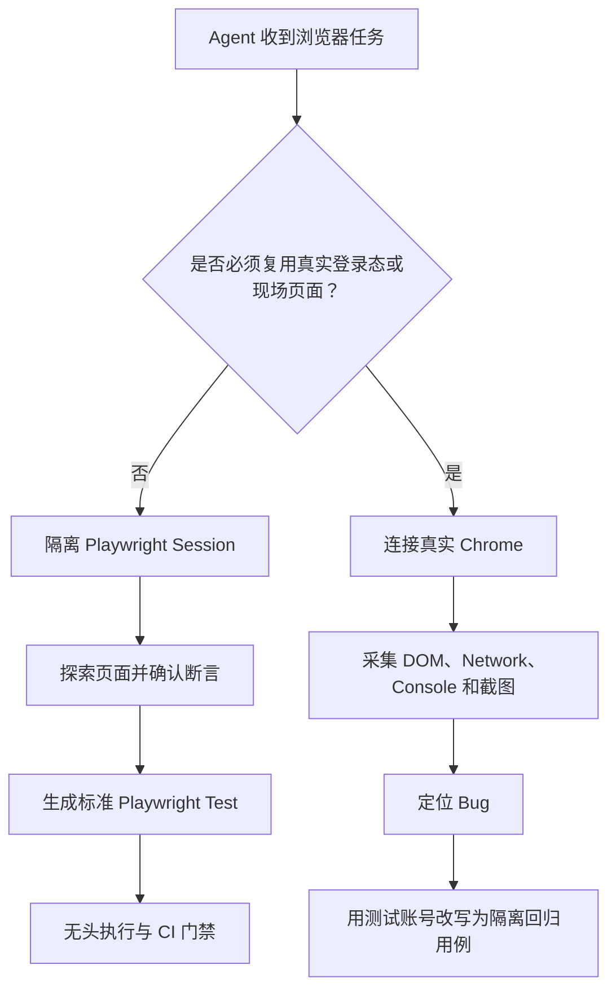

# Agent Browser CLI 自动化测试与真实会话排障手册

本文面向在内网或离线环境中使用 `agent-browser-cli` 的开发、测试和 Agent
使用者，覆盖以下场景：

- 让 Agent 探索被测系统并生成可维护的测试用例；
- 使用隔离 Chromium 执行无头、可重复的 UI/API 自动化测试；
- 在 CI 中把测试作为质量门禁；
- 复用用户真实 Chrome 的登录态和现场数据排查 Bug；
- 将真实会话中复现的问题沉淀为隔离回归测试。

完整参数以 `agent-browser-cli --help` 和
`agent-browser-cli pw <command> --help` 为准。

## 1. 先选择正确的浏览器模式

`agent-browser-cli` 提供两个互补、但安全边界不同的引擎。

| 场景 | 推荐模式 | 是否复用用户登录态 | 是否适合 CI | 典型入口 |
| --- | --- | --- | --- | --- |
| 稳定回归测试、冒烟测试 | 隔离 Playwright | 否 | 是 | `agent-browser-cli pw ...` |
| Agent 探索并生成测试用例 | 隔离 Playwright | 否 | 是 | `pw session` + `pw snapshot` |
| 已登录后台的现场 Bug 排查 | 真实 Chrome | 是 | 否 | `tabs`、`scan`、`network` |
| SSO、验证码、设备绑定问题 | 真实 Chrome | 是 | 否 | Chrome 扩展桥接 |
| UI/API 混合功能测试 | 隔离 Playwright | 仅共享测试 Session | 是 | `pw request`、`pw test` |
| 性能或压力测试 | 不使用本工具 | 不适用 | 不适用 | 使用 k6、JMeter 等 |



核心原则：

1. 可重复测试默认使用隔离 Playwright，不依赖个人 Chrome。
2. 真实 Chrome 用于现场复现和排障，不把 Cookie、Token 或个人 Profile 打进测试包。
3. 探索阶段可以使用 `@e` 临时引用，正式测试应使用 role、label、test id 等稳定定位器。
4. 所有账号、密码、Token 和环境地址通过环境变量或 CI Secret 注入。
5. 测试环境也要限制写操作范围，禁止 Agent 未经授权操作生产数据。

## 2. 环境准备

### 2.1 源码环境

```bash
npm ci
npm run playwright:check
npm run playwright:install
cargo build --release

./target/release/agent-browser-cli pw doctor
```

全局安装后可以直接使用：

```bash
agent-browser-cli pw doctor
```

`pw doctor` 应返回 Node、Playwright、Chromium、状态目录、制品目录和当前 Session
数量。`chromiumInstalled=true` 才表示浏览器介质已经准备好。

### 2.2 企业 CA 和代理

企业 CA 推荐通过运行环境注入：

```bash
export NODE_EXTRA_CA_CERTS=/etc/pki/internal-root-ca.pem
```

需要代理时，在创建 Session 时配置：

```bash
agent-browser-cli pw session create \
  --name proxy-smoke \
  --base-url https://app.test.intranet \
  --allow-host app.test.intranet \
  --proxy-server http://proxy.intranet:8080 \
  --proxy-bypass '*.test.intranet'
```

`--ignore-https-errors` 只用于明确接受风险的测试环境，不能作为企业 CA 配置的长期
替代方案。

## 3. 使用隔离无头浏览器探索系统

### 3.1 创建 Session

下面的命令会启动一个独立、默认无头的 Chromium：

```bash
agent-browser-cli pw session create \
  --name order-smoke \
  --base-url https://order.test.intranet \
  --allow-host order.test.intranet \
  --allow-host order-api.test.intranet \
  --locale zh-CN \
  --timezone Asia/Shanghai \
  --viewport-width 1440 \
  --viewport-height 900 \
  --trace
```

Session 的隔离边界：

- 每个 Session 使用独立 Chromium 进程和临时 user data 目录；
- Cookie、缓存和 Local Storage 不会读取用户真实 Chrome；
- 同一 Session 内的页面操作和 `pw request` 可以共享测试 Cookie；
- Session 关闭后删除临时 Profile；
- 截图、PDF 和 Trace 单独保留，具体目录以命令返回值或 `pw doctor` 为准。

`--allow-host` 是 CLI 调用层的目标白名单。通过 `pw open` 发起的顶层导航，以及
通过 `pw request` 发起的 API 请求，都必须命中白名单。需要由 CLI 直接访问多个
地址时，应逐一加入：

```bash
--allow-host order.test.intranet \
--allow-host auth.test.intranet \
--allow-host order-api.test.intranet
```

通配规则 `*.test.intranet` 只匹配子域，不匹配裸域 `test.intranet`。
云元数据地址、IPv4/IPv6 link-local 地址始终禁止。

该白名单不是完整的出站防火墙，不能保证拦截页面加载的每个子资源、页面脚本发起的
请求或所有重定向链路。要求完全网络隔离时，必须同时使用容器网络策略、主机防火墙
或受控代理，只允许访问被测网段。

### 3.2 查看并操作页面

```bash
agent-browser-cli pw open /login --session order-smoke
agent-browser-cli pw scan --session order-smoke
agent-browser-cli pw snapshot --session order-smoke
```

- `scan` 用于理解正文、状态和页面内容；
- `snapshot` 用于发现按钮、输入框、链接，并生成 `@e1`、`@e2` 等临时引用。

示例操作：

```bash
agent-browser-cli pw fill @e1 tester --session order-smoke
agent-browser-cli pw snapshot --session order-smoke
agent-browser-cli pw fill @e2 "$E2E_PASSWORD" --session order-smoke
agent-browser-cli pw snapshot --session order-smoke
agent-browser-cli pw click @e4 --session order-smoke
agent-browser-cli pw scan --session order-smoke
```

页面操作后应重新执行 `snapshot`。`@e` 只属于当前 Session 最近一次快照，不能写入
长期测试代码。

需要观察浏览器时，可以在本地临时使用 `--headed`：

```bash
agent-browser-cli pw session create \
  --name order-debug \
  --headed \
  --base-url https://order.test.intranet \
  --allow-host order.test.intranet
```

CI 和离线服务器应保持默认无头模式。

### 3.3 保存排障制品

```bash
agent-browser-cli pw screenshot \
  --session order-smoke \
  --filename login-failed.png \
  --full-page

agent-browser-cli pw pdf \
  --session order-smoke \
  --filename order-result.pdf

agent-browser-cli pw trace stop \
  --session order-smoke \
  --filename order-smoke-trace.zip
```

`--filename` 只指定文件名。命令返回的 `path` 才是最终制品绝对路径。

如果创建 Session 时没有使用 `--trace`，可以在关键操作前启动：

```bash
agent-browser-cli pw trace start --session order-smoke
```

结束后关闭 Session：

```bash
agent-browser-cli pw session close order-smoke
```

清理遗留 Session：

```bash
agent-browser-cli pw session list
agent-browser-cli pw session close-all
```

## 4. 让 Agent 生成测试案例

### 4.1 当前能力边界

当前工具不是浏览器“一键录制器”。推荐流程是：

1. 人提供测试目标、允许访问的 Host、测试账号和预期结果；
2. Agent 使用隔离 Session 探索页面；
3. Agent 把确认后的流程写成标准 `@playwright/test` 文件；
4. 人审查断言、选择器、数据清理和安全边界；
5. 使用 `agent-browser-cli pw test` 重复执行。

不要把一串临时 CLI 命令直接当成长期测试用例。

### 4.2 先写测试案例清单

建议先给 Agent 一张最小案例表：

| 字段 | 示例 |
| --- | --- |
| 案例 ID | ORDER-LOGIN-001 |
| 功能 | 订单后台登录 |
| 前置条件 | 测试账号有效，订单服务健康 |
| 操作 | 打开登录页，输入账号密码，提交 |
| 预期 | 跳转 `/orders`，显示当前测试用户 |
| 允许 Host | `order.test.intranet`、`auth.test.intranet` |
| 数据策略 | 只读，不创建生产订单 |
| 失败制品 | screenshot、trace、console 摘要 |

### 4.3 推荐的 Agent 提示词

```text
请使用 agent-browser-cli 的隔离 Playwright 模式测试订单系统。

目标：
1. 验证测试账号可以登录；
2. 验证订单列表至少出现表头；
3. 验证 /api/me 返回 200。

限制：
- 只允许访问 order.test.intranet、auth.test.intranet；
- 不使用或读取真实 Chrome 登录态；
- 不在源码中写入账号、密码、Cookie 或 Token；
- 账号密码读取 E2E_USER 和 E2E_PASSWORD；
- 探索完成后生成 tests/e2e/order-login.spec.mjs；
- 使用 role、label 或 data-testid 定位器，不把 @e 引用写进测试；
- 失败时保留 screenshot、trace 和 HTML report；
- 最后执行 agent-browser-cli pw test 并报告结果。
```

Agent 应输出：

- 测试案例清单；
- `playwright.config.mjs`；
- 一个或多个 `*.spec.mjs`；
- 运行命令；
- 实际通过/失败数量；
- 制品路径；
- 尚未验证的依赖或环境限制。

## 5. 标准 Playwright Test 示例

### 5.1 推荐目录

```text
project/
  playwright.config.mjs
  tests/
    e2e/
      order-login.spec.mjs
  artifacts/
  .gitignore
```

`.gitignore` 至少包含：

```gitignore
artifacts/
playwright-report/
test-results/
.auth/
```

### 5.2 配置文件

```js
// playwright.config.mjs
import { defineConfig } from "@playwright/test";

const artifactRoot =
  process.env.AGENT_BROWSER_REPORT_DIR || "artifacts/e2e";

export default defineConfig({
  testDir: "./tests/e2e",
  outputDir: `${artifactRoot}/test-results`,
  timeout: 30_000,
  expect: {
    timeout: 5_000,
  },
  fullyParallel: true,
  forbidOnly: Boolean(process.env.CI),
  retries: process.env.CI ? 1 : 0,
  workers: process.env.CI ? 2 : undefined,
  reporter: [
    ["line"],
    ["html", { outputFolder: `${artifactRoot}/html-report`, open: "never" }],
  ],
  use: {
    baseURL: process.env.E2E_BASE_URL,
    headless: process.env.E2E_HEADLESS !== "false",
    locale: "zh-CN",
    timezoneId: "Asia/Shanghai",
    viewport: { width: 1440, height: 900 },
    trace: "retain-on-failure",
    screenshot: "only-on-failure",
    video: "retain-on-failure",
  },
});
```

### 5.3 UI 与 API 混合用例

```js
// tests/e2e/order-login.spec.mjs
import { test, expect } from "@playwright/test";

test("测试账号登录并读取当前用户", async ({ page, context }) => {
  const user = process.env.E2E_USER;
  const password = process.env.E2E_PASSWORD;
  const baseURL = process.env.E2E_BASE_URL;

  test.skip(!user || !password || !baseURL, "缺少 E2E 测试环境变量");

  await page.goto("/login");
  await page.getByLabel("用户名").fill(user);
  await page.getByLabel("密码").fill(password);
  await page.getByRole("button", { name: "登录" }).click();

  await expect(page).toHaveURL(/\/orders/);
  await expect(
    page.getByRole("heading", { name: "订单列表" }),
  ).toBeVisible();

  // context.request 与当前浏览器 Context 共享测试 Cookie。
  const response = await context.request.get(
    new URL("/api/me", baseURL).toString(),
  );
  expect(response.ok()).toBeTruthy();

  const currentUser = await response.json();
  expect(currentUser.username).toBe(user);
});
```

定位器优先级：

1. `getByRole()`；
2. `getByLabel()`；
3. `getByTestId()`；
4. 稳定业务属性；
5. 最后才使用 CSS。

不要使用：

- 探索阶段生成的 `@e1`；
- 依赖 DOM 层级的长 CSS；
- 绝对 XPath；
- 固定 `waitForTimeout()` 代替状态断言；
- 生产账号、个人 Cookie 或硬编码 Token。

### 5.4 执行测试

```bash
export E2E_BASE_URL=https://order.test.intranet
export E2E_USER=agent-e2e
export E2E_PASSWORD='从安全介质注入'

agent-browser-cli pw test tests/e2e \
  --cwd . \
  --config playwright.config.mjs \
  --report-dir artifacts/order-e2e
```

只执行指定案例：

```bash
agent-browser-cli pw test tests/e2e \
  --cwd . \
  --grep '测试账号登录'
```

失败时 CLI 返回非零退出码，可以直接作为 CI 门禁。

注意：标准 `pw test` 会启动项目的 `@playwright/test` Runner，不套用交互式
`pw session` 的 `--allow-host` 策略。标准测试必须通过测试专用网络、容器网络策略、
防火墙或代理限制出站访问。

## 6. 使用 `pw request` 做 API 功能验证

无浏览器 Session：

```bash
agent-browser-cli pw request \
  https://order-api.test.intranet/health \
  --allow-host order-api.test.intranet \
  --method GET
```

POST JSON：

```bash
agent-browser-cli pw request \
  https://order-api.test.intranet/orders/validate \
  --allow-host order-api.test.intranet \
  --method POST \
  --header Content-Type=application/json \
  --data '{"sku":"A-100","quantity":1}'
```

与浏览器 Session 共享 Cookie：

```bash
agent-browser-cli pw request /api/me \
  --session order-smoke
```

强制使用独立 Cookie 容器：

```bash
agent-browser-cli pw request /api/me \
  --session order-smoke \
  --isolated-cookies
```

响应体默认最多保留 1 MiB。该命令用于功能验证，不应用于并发压测。

## 7. 在 CI 中执行无头测试

典型步骤：

```yaml
- uses: actions/checkout@v4
- uses: actions/setup-node@v4
  with:
    node-version: 24
- uses: dtolnay/rust-toolchain@stable

- run: npm ci --ignore-scripts
- run: npx playwright install --with-deps chromium
- run: cargo build --locked

- name: Run headless E2E
  env:
    E2E_BASE_URL: ${{ vars.E2E_BASE_URL }}
    E2E_USER: ${{ secrets.E2E_USER }}
    E2E_PASSWORD: ${{ secrets.E2E_PASSWORD }}
  run: >
    ./target/debug/agent-browser-cli pw test tests/e2e
    --cwd "${GITHUB_WORKSPACE}"
    --config playwright.config.mjs
    --report-dir "${GITHUB_WORKSPACE}/artifacts/e2e"
```

CI 设计建议：

- 测试账号只授予必要权限；
- 环境变量和 Secret 不打印到日志；
- 每次运行使用干净 Context；
- 失败时上传 screenshot、trace、video 和 HTML report；
- 制品设置保留期；
- CI Runner 只能访问被测网段；
- 测试产生的数据使用唯一前缀，并在用例结束后清理；
- 不把忽略 HTTPS 错误设为默认值。

## 8. 使用容器化离线安装器

流水线产物不是裸镜像，而是可解压安装的介质：

```bash
sha256sum --check \
  agent-browser-cli-playwright-v0.3.6-linux-x64-offline-installer.tar.gz.sha256
tar -xzf \
  agent-browser-cli-playwright-v0.3.6-linux-x64-offline-installer.tar.gz
cd agent-browser-cli-playwright-v0.3.6-linux-x64-offline-installer
./install.sh
```

目标主机要求：

- Linux x86_64；
- 已安装并启动 Docker 或 Podman；
- 安装过程不需要访问镜像仓库、npm 或公网。

无人值守安装：

```bash
./install.sh --yes
```

安装器会自动：

1. 校验介质内所有 SHA-256；
2. 导入内置 OCI 镜像；
3. 在 `--network none` 下执行 Runtime 和 Chromium 启动检查；
4. 安装统一的 `agent-browser-cli pw` 命令入口；
5. 执行一次安装后自检。

安装完成后直接运行：

```bash
agent-browser-cli pw doctor
agent-browser-cli pw session create \
  --name order-smoke \
  --allow-host order.test.intranet
agent-browser-cli pw open \
  https://order.test.intranet \
  --session order-smoke
agent-browser-cli pw session close order-smoke
```

离线安装与普通安装使用相同的 `agent-browser-cli pw` 命令。例如：

```bash
export E2E_BASE_URL=https://order.test.intranet
export E2E_USER=agent-e2e
export E2E_PASSWORD='通过安全介质注入'

agent-browser-cli pw test tests/e2e \
  --cwd /workspace/project \
  --config playwright.config.mjs \
  --report-dir /workspace/project/artifacts/e2e
```

启动器会把当前项目目录挂载到容器 `/workspace/project`，并为当前工作目录维护一个
后台 Runtime 容器，使多个命令之间可以复用隔离 Session。`E2E_*` 环境变量自动
转发。

使用受控内网容器网络：

```bash
agent-browser-cli pw runtime stop
export AGENT_BROWSER_PLAYWRIGHT_NETWORK=intranet-e2e
agent-browser-cli pw doctor
```

Runtime 管理和卸载：

```bash
agent-browser-cli pw runtime status
agent-browser-cli pw runtime stop

# 在安装目录执行
./uninstall.sh
```

安装器默认保留用户测试数据，避免误删截图、Trace 和报告。完整说明见介质中的
`README-OFFLINE.md`。

## 9. 复用真实 Chrome 登录态排查 Bug

真实 Chrome 模式通过扩展连接用户当前浏览器，保留：

- 已登录 Cookie；
- Local Storage 和 Session Storage；
- SSO、设备认证和企业插件环境；
- 用户正在查看的标签页和页面现场。

这类操作不具备测试隔离性，不用于 CI。对生产或敏感系统执行点击、提交、删除、
审批等操作前，必须明确目标和授权范围。

### 9.1 推荐的 Agent 提示词

```text
请使用 agent-browser-cli 的真实 Chrome 模式排查当前订单后台页面。

要求：
- 复用我已经登录的 work Profile；
- 先定位正确 tab，不新建账号、不复制 Cookie；
- 在复现前启动 network 和 console 监听；
- 只执行只读查询，不提交、审批或删除数据；
- 记录 URL、关键 DOM 状态、Console error、失败请求 ID 和状态码；
- 保存一张失败页面截图；
- 排查结束后停止 network/console 监听；
- 最后给出根因证据和可转成隔离回归测试的步骤。
```

### 9.2 定位正确的浏览器现场

```bash
agent-browser-cli tabtree --full
agent-browser-cli tabs --profile work
agent-browser-cli lookup tab <tabId>
```

首次使用多 Profile 时可以设置短标签：

```bash
agent-browser-cli profile-label set work --profile <profile_id>
```

多 Profile 或多浏览器实例下，不要只猜 `tabId`。必要时同时传入：

```bash
--tab <tabId> --profile work
```

### 9.3 在复现前启动监听

`network` 和 `console` 只记录启动监听之后发生的事件：

```bash
TAB=<tabId>

agent-browser-cli network start --tab "$TAB" --profile work
agent-browser-cli console start --tab "$TAB" --profile work
```

记录页面基线：

```bash
agent-browser-cli scan --tab "$TAB" --profile work --text-only
agent-browser-cli snapshot --tab "$TAB" --profile work --details
agent-browser-cli screenshot \
  --tab "$TAB" \
  --profile work \
  --full-page \
  --out /tmp/order-before.png
```

### 9.4 复现问题

选择器明确时直接操作：

```bash
agent-browser-cli click 'button[data-testid=search]' \
  --tab "$TAB" \
  --profile work \
  --monitor \
  --wait-js 'return document.body.innerText.includes("查询结果")' \
  --wait-timeout 10
```

选择器不明确时：

```bash
agent-browser-cli snapshot --tab "$TAB" --profile work
agent-browser-cli click @e4 --tab "$TAB" --profile work --monitor
```

页面变化后重新 `snapshot`，不要复用旧的 `@e`。

### 9.5 检查 Console 和 Network

```bash
agent-browser-cli console list \
  --tab "$TAB" \
  --profile work \
  --level error \
  --limit 100

agent-browser-cli network list \
  --tab "$TAB" \
  --profile work \
  --filter /api/orders \
  --limit 100

agent-browser-cli network detail <requestId> \
  --tab "$TAB" \
  --profile work
```

重点记录：

- 请求 URL 和方法；
- HTTP 状态码；
- 请求时间；
- 业务错误码；
- 截断后的响应摘要；
- 对应 Console error；
- 页面操作发生前后的 DOM 差异。

`network detail` 可能包含敏感响应，不能把完整 Token、Cookie、身份证号、手机号或
大响应体直接粘贴到 Issue、Agent 对话或 CI 日志。

### 9.6 检查页面运行时状态

只读取必要状态：

```bash
agent-browser-cli exec \
  --tab "$TAB" \
  --profile work \
  'return {
    title: document.title,
    url: location.href,
    readyState: document.readyState,
    hasUser: Boolean(window.__CURRENT_USER__),
    visibleErrors: [...document.querySelectorAll("[role=alert]")]
      .map(x => x.innerText)
      .slice(0, 10)
  }'
```

复杂脚本写入文件再执行：

```bash
agent-browser-cli exec \
  --tab "$TAB" \
  --profile work \
  --file /tmp/inspect-order-page.js
```

不要读取或输出 Cookie/Token 的实际值。大多数登录态问题只需要确认“是否存在”、
过期时间、所属域或接口返回状态。

### 9.7 收尾

```bash
agent-browser-cli screenshot \
  --tab "$TAB" \
  --profile work \
  --full-page \
  --out /tmp/order-failed.png

agent-browser-cli network stop --tab "$TAB" --profile work
agent-browser-cli console stop --tab "$TAB" --profile work
```

停止监听会清理 daemon 内的调试缓存并释放持续 CDP attach。

## 10. 从现场 Bug 生成回归测试

真实 Chrome 中的证据应转换成业务条件，而不是复制现场会话：

| 现场信息 | 回归测试中的写法 |
| --- | --- |
| 个人登录 Cookie | 使用测试账号登录或测试环境签发状态 |
| `tabId`、`session_key` | 不写入测试 |
| `@e4` | 改成 role、label 或 test id |
| 失败请求 ID | 改成 URL、方法和业务断言 |
| 页面临时 DOM | 找稳定可访问名称或业务属性 |
| 生产数据 ID | 使用测试数据工厂创建唯一数据 |
| 手工等待 5 秒 | 等待 URL、响应或可见状态 |

推荐提示词：

```text
根据刚才真实 Chrome 中复现的 Bug，生成一个隔离 Playwright 回归测试。

要求：
- 不读取或复制真实 Cookie、Token、tabId、session_key；
- 使用测试账号和 E2E_* 环境变量；
- 用稳定语义定位器；
- 断言失败接口对应的页面错误行为；
- 用例运行后清理测试数据；
- 输出 spec 文件并实际执行 pw test；
- 失败时保留 trace、screenshot 和 HTML report。
```

## 11. Bug 报告模板

```markdown
## 环境
- 系统/版本：
- Chrome Profile Label：
- 页面 URL：
- 发生时间：

## 前置条件
- 使用的角色：
- 测试数据：

## 复现步骤
1.
2.
3.

## 预期结果

## 实际结果

## 证据
- Screenshot：
- Console error：
- Network request ID / URL / status：
- 页面状态摘要：

## 初步根因

## 回归测试
- 案例 ID：
- spec 文件：
- CI Run：
```

报告中不要附带密码、Cookie、Token、完整敏感响应或个人信息。

## 12. 常见问题

### `pw doctor` 提示 Chromium 未安装

```bash
npm run playwright:install
agent-browser-cli pw doctor
```

离线环境需要使用已包含固定 Chromium revision 的介质。

### `Target host is not allowed`

检查传给 `pw open` 或 `pw request` 的目标 Host 是否已经加入 Session 的
`--allow-host`。不要为了省事放开任意公网域名。页面子资源加载失败时，应继续检查
DNS、企业 CA、代理和容器出站策略，而不是盲目扩大 CLI 白名单。

### `@e` 找不到

页面已经发生变化，或引用来自另一个 Session。重新执行：

```bash
agent-browser-cli pw snapshot --session <session>
```

真实 Chrome 模式也需要在页面变化后重新 `snapshot`。

### 真实 Chrome 没有可用标签页

先直接执行目标命令；只有失败后再检查：

```bash
agent-browser-cli tabs
agent-browser-cli status
agent-browser-cli doctor
agent-browser-cli logs --tail 100
```

Chrome 至少打开一个普通 HTTP(S) 页面，并确认扩展已经加载。daemon 未常驻本身不
代表故障。

### Network/Console 没有记录

监听必须在复现前启动。扩展修改或升级后需要在 Chrome 扩展页面重载扩展，并刷新
被测页面。

### 标准测试在本机通过、CI 失败

重点比较：

- Node、Playwright 和 Chromium 版本；
- 企业 CA；
- DNS 和代理；
- 时区、Locale 和 viewport；
- 测试账号权限；
- CI 网络访问范围；
- 是否意外依赖本机缓存或登录态。

### 测试偶发失败

优先修复：

- 用固定 sleep 等页面；
- 不稳定 CSS/XPath；
- 用例之间共享可变数据；
- 多用例复用同一账号并并发写数据；
- 未等待接口或 URL 状态；
- 测试环境服务不健康。

不要只通过无限重试掩盖问题。

## 13. 快速命令表

隔离 Playwright：

```bash
agent-browser-cli pw doctor
agent-browser-cli pw session create --name demo --allow-host app.test.intranet
agent-browser-cli pw open https://app.test.intranet --session demo
agent-browser-cli pw scan --session demo
agent-browser-cli pw snapshot --session demo
agent-browser-cli pw screenshot --session demo --full-page
agent-browser-cli pw request https://app.test.intranet/health \
  --allow-host app.test.intranet
agent-browser-cli pw test tests/e2e --cwd .
agent-browser-cli pw session close demo
```

真实 Chrome：

```bash
agent-browser-cli tabtree --full
agent-browser-cli scan --tab <tabId> --text-only
agent-browser-cli snapshot --tab <tabId>
agent-browser-cli network start --tab <tabId>
agent-browser-cli console start --tab <tabId>
agent-browser-cli network list --tab <tabId>
agent-browser-cli console list --tab <tabId> --level error
agent-browser-cli screenshot --tab <tabId> --full-page
agent-browser-cli network stop --tab <tabId>
agent-browser-cli console stop --tab <tabId>
```

更底层的 Runtime、安全策略和离线目录说明见
[Playwright 隔离运行时](./PLAYWRIGHT-RUNTIME.md)。真实 Chrome 的完整 Agent SOP
见 [`skills/agent-browser-cli/SKILL.md`](../skills/agent-browser-cli/SKILL.md)。
